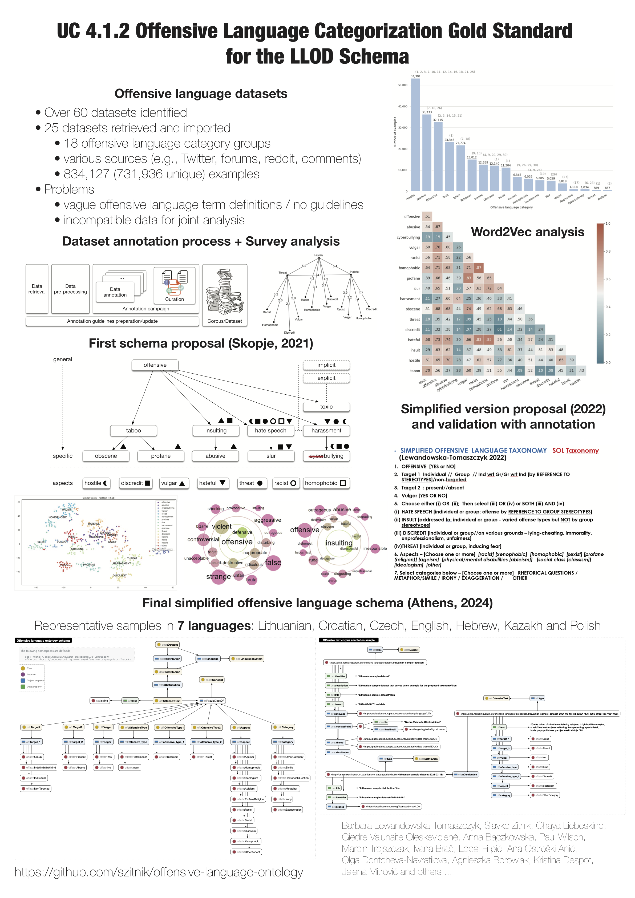

# UC 4.1.2 Offensive language categorization gold standard for the LLOD schema

This repository represents final LLOD schema for offensive language, gradually developed within the [COST NexusLinguarum action](https://nexuslinguarum.eu/), Task 4.1, Use Case 4.1.2.

The ontology schema and an encoded annotation example is available in the folder 'ontology.' The docs folder contains generated documentation of the schema, also available at [https://szitnik.github.io/offensive-language-ontology/docs/index-en.html](https://szitnik.github.io/offensive-language-ontology/docs/index-en.html).

The 'source-sample-documents' contain representative offensive language examples for the proposed schema in 7 different languages.

The 'other' folder contains some supporting materials.

## Poster presentation in the final COST Meeting in Athens, March 20-21, 2024

## Final ontology schema visualization

## An example of offensive language annotation encoding visualization

